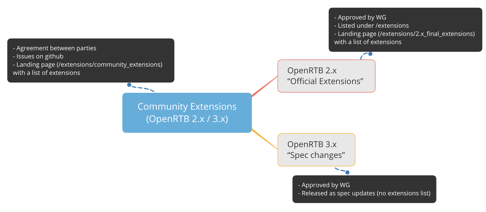

# **Extensions**

#### What is the lifecycle of an Extension?
When individual companies want to solve a problem that isn't covered by the core OpenRTB (or AdCOM) specs, they can use OpenRTB's (and AdCOM's) extensions mechanism to implement a solution. They can work on it privately and limit usage between themselves, or they can make the OpenRTB "Community" aware of this extension to guage the usefulness of that extension. After a period of time, if there is sufficient support, the extension can be made part of the "official" specs by getting approval from the Programmatic Supply Chain Working Group. This path is slightly different for OpenRTB 2.x and 3.x because the Working Group has decided that there will be no more updates to 2.x. So with 2.x the extension gets moved to the "Official extensions" folder, while with 3.x it gets added to the OpenRTB/AdCOM specs and released as a new version of the spec.

#### How do I submit a "community extension"?
1. Submit an issue on the github repository for OpenRTB or AdCOM.
2. Submit a PR associated with that issue, including an entry in the community extensions landing page, and any additional files needed.

#### How do I get a community extension formally adopted into the specs?
1. Submit an issue and PR with the desired changes on the github repository for OpenRTB or AdCOM.
2. Email us at openmedia@iabtechlab.com with any information not in the issue/PR, including any  adoption information for the community extension. 
3. We will discuss in the Programmatic Supply Chain Working Group and (assuming you are a Tech Lab member) likely invite you to present.

#### What are the current community extensions?
You can find the current extensions in the [extensions/community_extensions](../extensions/community_extensions) folder.
