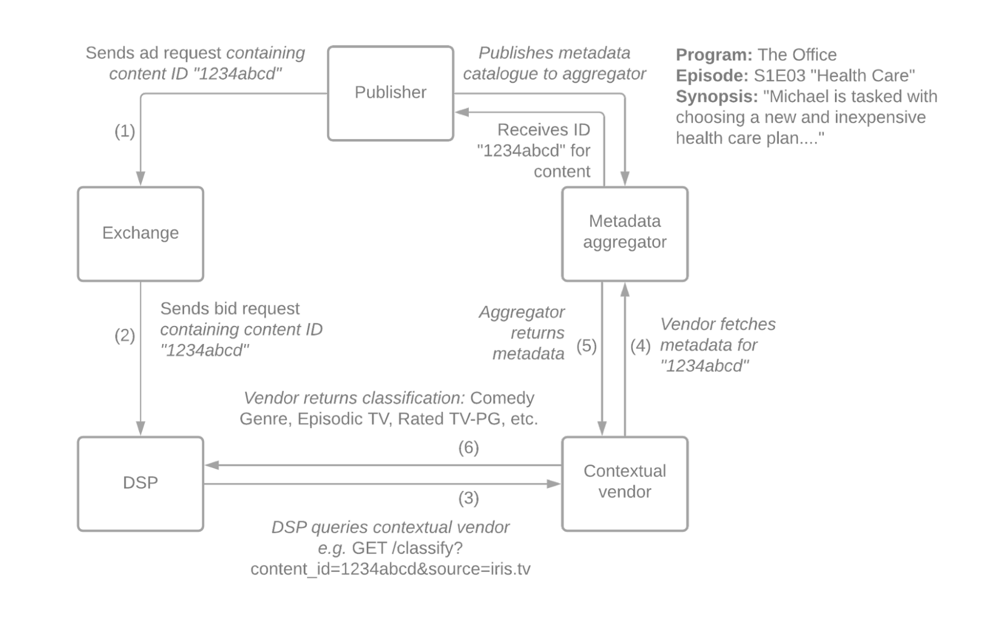

# Extended Content Identifiers

2022-01-19


## Sponsors

* Ian Trider, Basis Technologies
* Joseph Hirsch, SpringServe
* Gerry Swinton, Magnite, Inc.
* Mark Rogers, Oracle Advertising
* Rob Caliolo, JW Player
* C.J. Leonard, IRIS.TV
* Kwun Choy, Freewheel
* Daniel Church, Beachfront
* Emera Trujillo, MediaMath
* Nate Leaf, Comscore
* Patrick McCann, CafeMedia


## Background

There is a market desire to target by video/audio content metadata or contextual classifications thereof. This requires some sort of scheme for identifying individual pieces of content, transmitting that in a bid request, and enabling lookup or classification of that piece of content’s metadata.

There are several companies/services which act as a clearinghouse or aggregator of metadata from publishers ("*Content Data Platform*"). Examples include IRIS.TV and JWPlayer. These services ingest video content metadata from publishers and assign an ID for each piece of content that is unique within that content data platform. There are contextual data vendors, such as Oracle and comScore, who have access to this aggregated metadata and, if provided a content ID, can return classifications of the content based on what is available in that metadata. 

The following diagram illustrates how this works.  The numbers indicate the essential flow/sequence from the perspective of the DSP. Data flow between publishers and the content data platform is out of band from the RTB process.





In the RTB process, the sequence is as follows:


1. The publisher includes a content ID (and the source of that ID) in its request to the exchange for ad fill. This will be a content ID previously assigned by the content data platform.
2. The exchange includes this in the bid request to the DSP.
3. The DSP queries its contextual vendor with this.
4. The contextual vendor requests the metadata from the content data platform.
5. The content data platform returns it.
6. The contextual vendor returns classifications to the DSP. These classifications are as agreed upon between the contextual vendor and DSP, and are based on transforming or classifying information from the metadata in some way. For example, the vendor could perform topic classification on a synopsis, or perform video/audio recognition on a content URL. 

In practice, one or more layers of caching may be involved in steps 3-6 due to the real-time constraint of RTB.


## What this document is – and is not

This community extension addresses #2 -- how the content ID information is to be conveyed in bid requests, so that DSPs can request classifications from contextual vendors.

It addresses passing a unique ID for a single piece of video/audio content. **It does not address passing categorizations of the content (“Comedy”, “Personal Finance”, etc.) according to some taxonomy.** For that, see [Segment Taxonomies community extension](https://github.com/InteractiveAdvertisingBureau/openrtb/blob/master/extensions/community_extensions/segtax.md) and the IAB [Seller-defined Audience and Context Signalling](https://iabtechlab.com/wp-content/uploads/2021/03/IABTechLab_Taxonomy_and_Data_Transparency_Standards_to_Support_Seller-defined_Audience_and_Context_Signaling_2021-03.pdf) standard.

This is an extension for OpenRTB 2.x that describes where SSPs/exchanges should place these vendor-specific content IDs that they receive from publishers. DSPs who wish to consume these IDs should look for these in this extension. Additionally, SSPs/exchanges could act as a vendor for content IDs if desired -- for example, if they also act as the content management platform for publishers.


## Specification

In the “ext” object of the “data” object array of the “content’ object of OpenRTB 2.x bid requests:


<table>
  <tr>
   <td><strong>Field</strong>
   </td>
   <td><strong>Type</strong>
   </td>
   <td><strong>Description</strong>
   </td>
  </tr>
  <tr>
   <td>cids
   </td>
   <td>string array
   </td>
   <td>An array of content IDs, representing one or more identifiers for the video or audio content from the ID source specified in the “name” field of the “data” object.
   </td>
  </tr>
</table>


Specifically **not** used is the existing “id” field in the “content” object, as this is known to conflict with internal uses of this field by publishers and exchanges, and does not provide for a way to communicate the source of the ID.

In practice, it is expected that a typical request will have only one content ID from one source, however there are theoretically cases for multiple IDs, or multiple ID sources, and thus an array is used.


### Identifying source

The “data” object itself contains a “name” string field which shall be used to convey the domain of the content ID provider/source, expressed as “root domain” (public suffix list + 1, aka “[top private domain](https://github.com/google/guava/wiki/InternetDomainNameExplained#public-suffixes-and-private-domains)”). This is consistent with the [Seller-defined Audience and Context Signalling](https://iabtechlab.com/wp-content/uploads/2021/03/IABTechLab_Taxonomy_and_Data_Transparency_Standards_to_Support_Seller-defined_Audience_and_Context_Signaling_2021-03.pdf) standard, thus allowing for bid requests that contain both the actual content ID, as well as any seller-supplied categorizations.

Providers/sources of content IDs shall decide on a root domain which they own and will consistently use to identify themselves. Typically, this should be the business or operational domain of the provider. If a publisher is passing its own content IDs which do not come from some metadata aggregator, it should likewise choose and consistently use a root domain that it owns as the way it identifies itself.

It is not assumed that the content ID string or name string (representing ID source) has any meaning whatsoever to exchanges and DSPs. They need only pass it onwards to contextual vendors, who are responsible for making their own arrangements to source metadata from the content ID sources that their DSP partners will observe. It is also possible that DSPs could make arrangements with content data platforms themselves instead of sending to contextual vendors.


### Example


```
{
  "site": {
    "content": {
      "data": [
        {
          "name": "iris.tv",
          "ext": {
            "cids": [
              "iris_c73g5jq96mwso4d8"
            ]
          }
        }
      ]
    }
  }
}
```


### Example - Content ID and Seller-Defined Context

**NOTE:** Seller-Defined Context is out of scope of this extension, but this example is provided to show how this extension is aligned with, and can be used in tandem with seller-defined context.  See [Segment Taxonomies community extension](https://github.com/InteractiveAdvertisingBureau/openrtb/blob/master/extensions/community_extensions/segtax.md) and the IAB [Seller-defined Audience and Context Signalling](https://iabtechlab.com/wp-content/uploads/2021/03/IABTechLab_Taxonomy_and_Data_Transparency_Standards_to_Support_Seller-defined_Audience_and_Context_Signaling_2021-03.pdf) standard.


```
{
  "site": {
    "content": {
      "data": [
        {
          "name": "iris.tv",
          "segment": [
            {
              "id": "ic_5784065"
            },
            {
              "id": "ic_5711828"
            }
          ],
          "ext": {
            "segtax": 501,
            "cids": [
              "iris_c73g5jq96mwso4d8"
            ]
          }
        }
      ]
    }
  }
}
```
